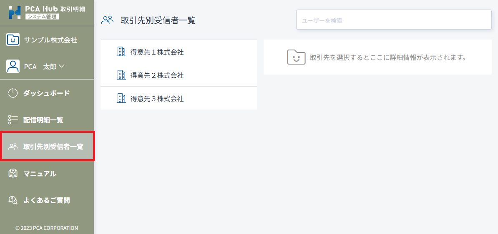
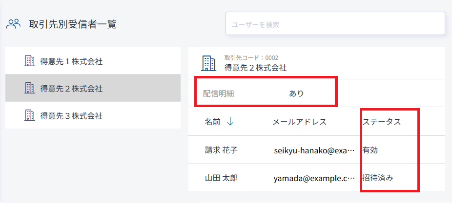
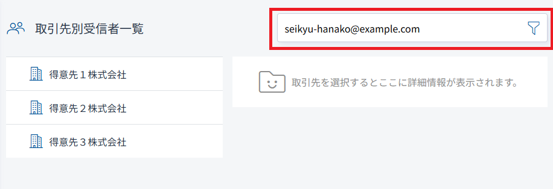
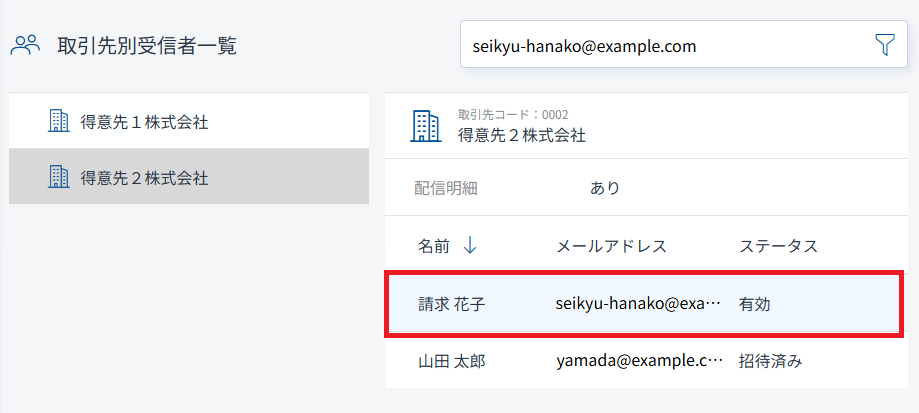

# 取引先の受信者を確認する<!-- omit in toc -->

取引先に所属している受信者を確認することができます。

## 目次<!-- omit in toc -->

- [制限](#制限)
- [取引先の受信者を確認する](#取引先の受信者を確認する)
- [ユーザーがどの取引先に所属しているか確認する](#ユーザーがどの取引先に所属しているか確認する)

## 制限

- 取引先別受信者一覧の機能は PCA Hub 取引明細のシステム管理者のみが行うことができます。

## 取引先の受信者を確認する

1. PCA Hub 取引明細の管理サイトにアクセスします。
2. 「取引先別受信者一覧」ページにて、取引先の一覧が表示されます。 
 
3. 取引先を選択すると、受信者一覧が表示されます。 
取引先への配信明細があるかどうか、受信者のメールアドレス、ステータスを確認することができます。 
 

## ユーザーがどの取引先に所属しているか確認する

1. ユーザーの検索条件を入力して検索します。 
ユーザーの氏名や、メールアドレスなどで検索することができます。 
 
2. 検索条件に合うユーザーが所属している取引先の一覧が表示されます。 
3. 取引先を選択すると、受信者一覧が表示されます。 
検索条件に合うユーザーは背景色が青になります。 
 
