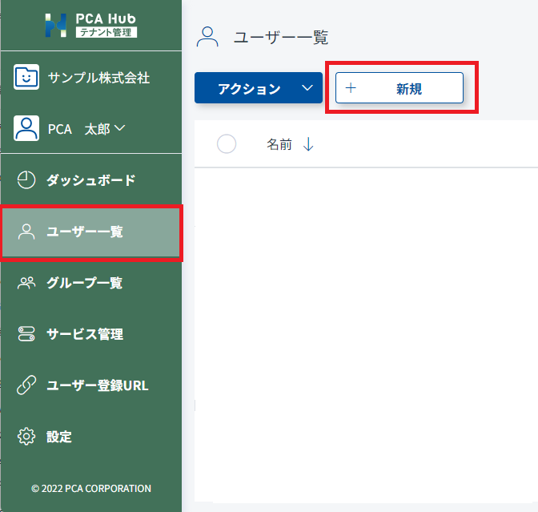
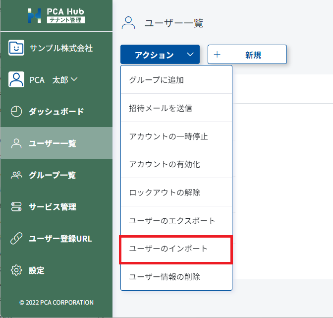

# 実務担当者のアカウントを作成する<!-- omit in toc -->

PCA Hub 取引明細を利用するには、PCA Hub のアカウントが必要です。 
PCA Hub のアカウントは個別または一括で作成することができます。 
PCA Hub アカウントが作成されると、アカウントの初期設定を行うためのメールが配信されます。 

## 目次<!-- omit in toc -->

- [制限](#制限)
- [手動でアカウントを作成する](#手動でアカウントを作成する)
- [CSV ファイルからアカウントを作成する](#csv-ファイルからアカウントを作成する)
- [PCA Hub アカウントが作成されたら](#pca-hub-アカウントが作成されたら)

## 制限

- PCA Hub のアカウントの作成はテナント管理者のみが行うことができます。 

## 手動でアカウントを作成する

1. テナント管理サイトのユーザー一覧にアクセスします。 
2. [新規] ボタンをクリックして新規入力ダイアログを表示します。 
3. 基本情報の必須項目を入力します。 
4. [保存] ボタンをクリックして入力内容を保存します。 

 

## CSV ファイルからアカウントを作成する

1. [PCA Hub ユーザー CSV ファイルフォーマット](https://pca.jp/area_support/manual/hubedoc/03_manager/manager_12.html) で、CSVファイルを作成します。
2. テナント管理サイトのユーザー一覧にアクセスします。
3. アクションメニューから「ユーザーのインポート」をクリックして CSV ファイルを選択します。 
 

4. インポートが完了して結果ログがダウンロードされるまでしばらく待ちます。
5. ダウンロードされたログファイルを開いてインポート結果を確認します。 
 

## PCA Hub アカウントが作成されたら

各実務担当者は、配信されたメールから初期設定を実行してください。 
初期設定手順は [PCA Hub にログインするための手順](../../startup.md#pca-hub-にログインするための手順) をご覧ください。
