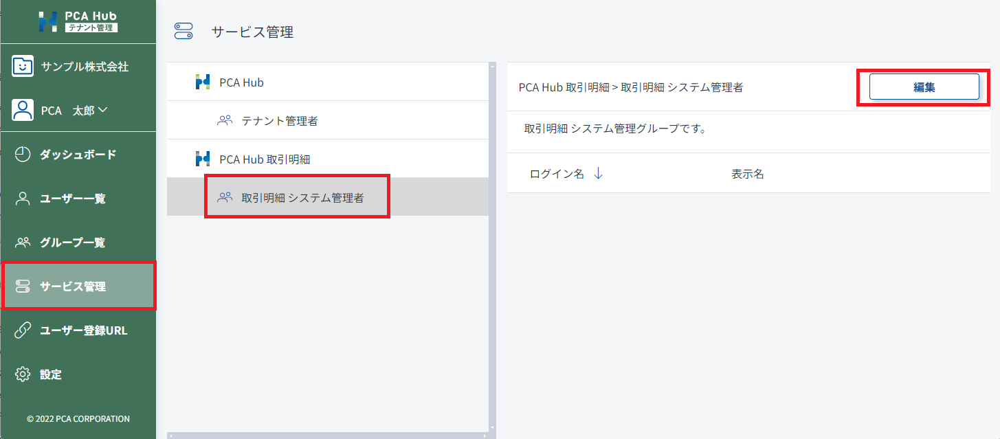

# システム管理者を設定する<!-- omit in toc -->

PCA Hub 取引明細のシステム管理者を設定します。 
実務担当者のアカウントはシステム管理者に設定してください。 

## 目次<!-- omit in toc -->

- [制限](#制限)
- [システム管理者の役割](#システム管理者の役割)
- [システム管理者の設定方法](#システム管理者の設定方法)

## 制限

- システム管理者の設定はテナント管理者のみが行うことができます。

## システム管理者の役割

システム管理者は、主に明細の配信と管理を行います。 
システム管理者が実行する権限を持つ機能は下記のとおりです。 

- [取引明細配信のための設定を行う](../system_admin/system_admin1.md)
  - [リマインドメールを設定する](../system_admin/system_admin1.md#リマインドメールを設定する)
  - [案内事項を作成する](../system_admin/system_admin1.md#案内事項を作成する)
  - [配信先の登録を行う](../system_admin/system_admin1.md#配信先の登録を行う)
- [明細を配信する](../system_admin/system_admin2.md)
  - [明細をアップロードする](../system_admin/system_admin2.md#明細をアップロードする)
  - [明細の公開日時を変更する](../system_admin/system_admin2.md#明細の公開日時を変更する)  
  - [アップロードした明細を削除する](../system_admin/system_admin2.md#アップロードした明細を削除する)
- [ダッシュボードを確認する](../system_admin/system_admin3.md)
  - [使用可能枚数の状況を確認する](../system_admin/system_admin3.md#使用可能枚数の状況を確認する)
  - [監査ログを確認する](../system_admin/system_admin3.md#監査ログを確認する)

## システム管理者の設定方法

1. テナント管理サイトのサービス管理にアクセスします。
2. 「取引明細 システム管理者」を選択します。
3. [編集] ボタンをクリックして任意のアカウントを追加します。
4. [保存] ボタンをクリックして設定内容を保存します。

 
