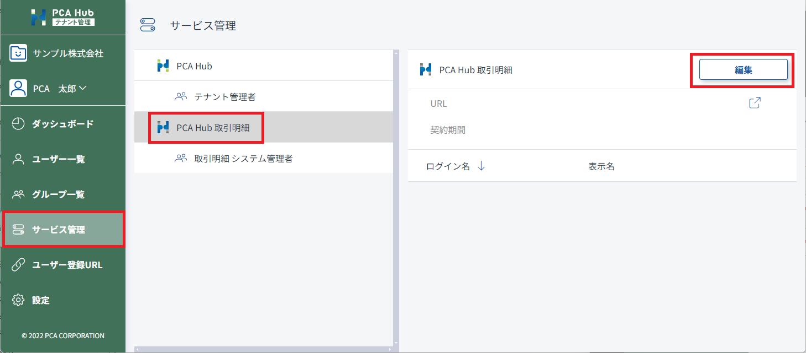
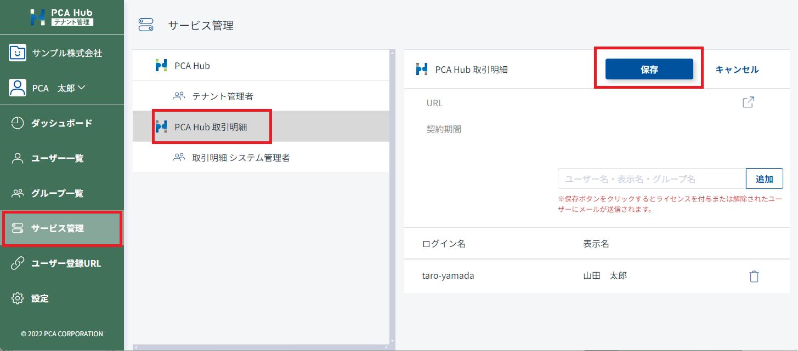

# ライセンスを付与する<!-- omit in toc -->

取引明細を配信するには、明細を受け取る配信先ユーザーに対してライセンスを付与する必要があります。 
通常、PCA 商魂・商管シリーズから [配信先の登録](../system_admin/system_admin1.md#配信先の登録を行う) を行うことで、配信先ユーザーにライセンスが付与されています。 
ライセンスを付与する人数に制限はありません。 

## 目次<!-- omit in toc -->

- [制限](#制限)
- [配信先ユーザーにライセンスを付与する](#配信先ユーザーにライセンスを付与する)
- [配信先ユーザーのライセンスを解除する](#配信先ユーザーのライセンスを解除する)

## 制限

- ライセンスの付与はテナント管理者のみが行うことができます。

## 配信先ユーザーにライセンスを付与する

1. テナント管理サイトのサービス一覧にアクセスします。 
2. 「PCA Hub 取引明細」を選択します。 
3. [編集] ボタンをクリックして任意のアカウントを追加します。 
4. [保存] ボタンをクリックして設定内容を保存します。 

 

### ポイント<!-- omit in toc -->

- ライセンスを付与すると、付与された配信先ユーザー向けに PCA Hub 取引明細のクライアントサイトに誘導するメールが送信されます。 

## 配信先ユーザーのライセンスを解除する

1. テナント管理サイトのサービス管理にアクセスします。 
2. 「PCA Hub 取引明細」を選択します。 
3. [編集] ボタンをクリックしてライセンスを解除したいアカウントのごみ箱マークをクリックします。 
4. [保存]ボタンをクリックして設定内容を保存します。 

 
