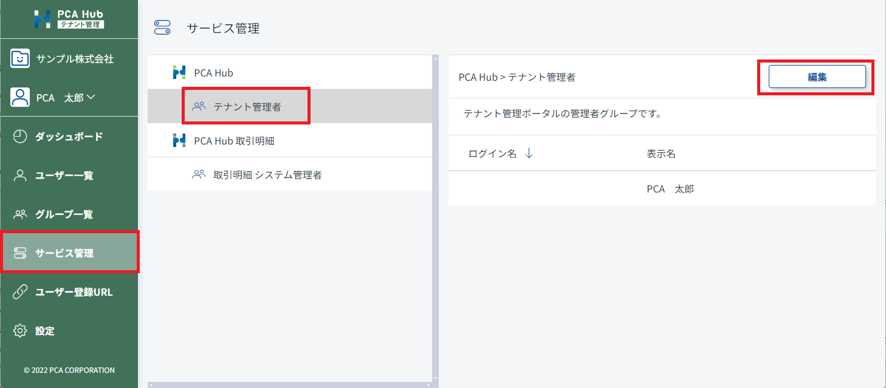

# テナント管理者を追加する<!-- omit in toc -->

ご契約テナントのテナント管理者を設定します。 
テナント管理者は必ず1名以上を設定してください。 
テナント管理者はユーザーの管理やライセンス付与等のPCA Hub全般の設定・管理を行います。設定は慎重に行ってください 

## 目次<!-- omit in toc -->

- [制限](#制限)
- [テナント管理者を追加する](#テナント管理者を追加する)

## 制限

- テナント管理者の追加は、テナント管理者のみが行うことができます。

## テナント管理者を追加する

1. テナント管理サイトのサービス一覧にアクセスします。 
2. 「テナント管理者」を選択します。 
3. [編集] ボタンをクリックして任意のアカウントを追加します。 
4. [保存] ボタンをクリックして設定内容を保存します。 
